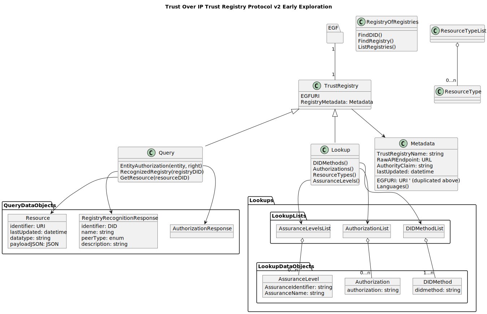
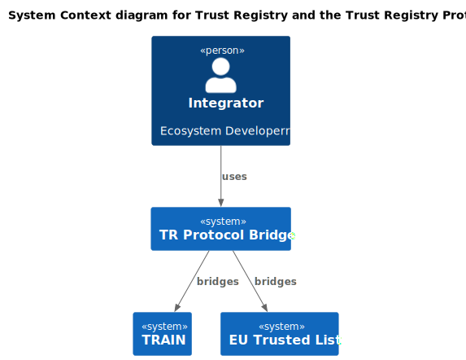

# Placeholder TRQP README v2

_note_: the name of the protocol is being deliberated. TRQP is a standing name until we have aligned on a long term name. 

The Trust Registry Query Protocol serves to provide a simple interface to the plethora of systems that contain answers that are required to make trust decisions. 

The TRPQ does not:  
  * implement governance - the system-of-record that supports the TRPQ may do this.
  * make decisions - the TRPQ serves up data that are inputs to trust decisions.
  * assign Roles or Rights, though a consuming system may take information that is received via the TRPQ and assign these.

## Design Decisions

* multi-lingual support will NOT be created as the API (protcol) is intended for non-human use. That said, we will need some ability to map identifiers (e.g. AssuranceLevelType.identifier) to human-readable names and descriptions. 
* Registry, Entity Authorizations, and Registry of Registry functionality are interwoven. Which leads to...

## ISSUE - Querying vs. Snooping

Querying the most basic query "Does this Entity (identified with VID) have this Authorization (identified with VID)?" feels too complex.
  `/query/{entity-VID}?authorization="authorization-VID"` where the `authorization` parameter is required.
  * but just looking (inspecting, snooping) at an Entity feels invasive.

This issue may mean that the general Entity queries should be separated from a browseable API???

OPTIONS:

* specify that HTTP 405 (Method Not Allowed) MUST be returned if a particular feature (browsing) is NOT allowed. https://www.rfc-editor.org/rfc/rfc7231#section-6.5.5 
  * could create implementor's guide for MANDATORY & OTHER (profiles)
  * This (i.e. returning 405) is an odd way of dealing with an issue. 
* create 2 (or more) APIs - most basic and richer?
* other???

## UPDATE 2023-12-07

Key changes made:
  * Path & Parameter approach implemented
    * PATH for first-class objects (e.g. Entities in TR)
    * PARAMETERS for filtering/refining/naming data returned
  * ___Type and ____ListType used for main objects and the array/list of those objects
  * Added DIDMethod object.
  * Added Integrity object for Resources (ref only?)
  * Resources
    * Referenced - points to a URL
    * Direct - JSON payload?
  * NAMESPACES - added (early) namespaces concept. 

## Requirements

Requirements capture is located at:

* [requirements.md](../v2/requirements.md) - contains a rudimentary set of requirements (WORK IN PROGRESS - really just started)
* 

## OpenAPI Specification

The first "concrete" API specification is an Open API Specification v3 YAML file. 

[OAS (.yaml) for TRPQ v2](../v2/api/WIP.toip.trustregistry.api.yaml)

## Logical Model

### High-Level

We provide a high-level object model (NOTE: source of truth is the Swagger as this diagram may be out of date during development)

### Integration Model

As the TRPQ is a protocol, those systems that don't natively support it can be connected via "bridge". 

An early example is shown below:

